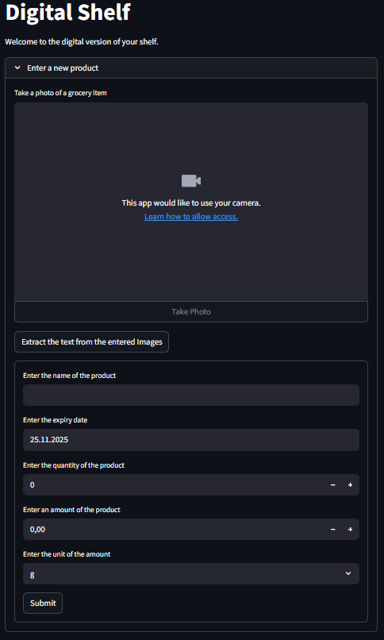
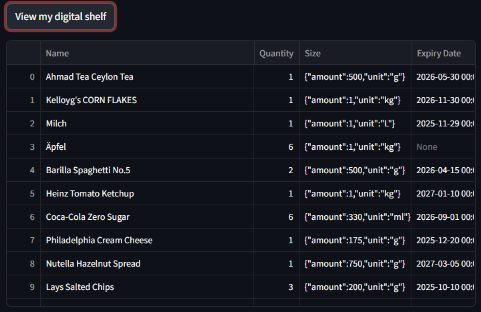
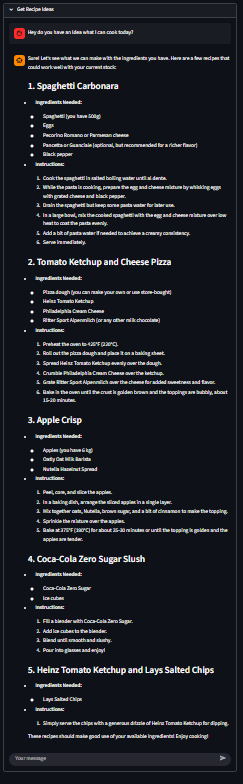

# Digital Shelf – Solution Deployment Overview

This project comprises a fully working pipeline for our Solution Deployment course. The stack ingests grocery product imagery through a local PaddleOCR server, validates the extracted text with a locally hosted Qwen2.5 7B model via OLAMA and exposes the curated digital shelf data through a web frontend routed behind a reverse proxy.

# What You Can Do With the Digital Shelf
The Digital Shelf app provides a way for managing grocery product data through OCR and LLM-powered automation. Users can add new products by uploading an image of an item, which is processed through the OCR -> LLM pipeline to extract key attributes, normalize them and generate a valid Pydantic-compatible JSON schema. This structured product entry is then stored in the local PostgreSQL database.



Once data is stored, the View Products section allows users to browse the entire digital shelf. All items are fetched directly from the database and displayed in a streamlined UI that makes it easy to inspect, validate or compare product entries.



The Get Recipes feature extends the platform by enabling users to chat with the same locally hosted LLM. The model is primed with the list of available products and can suggest personalized recipe ideas e.g., what to cook for lunch or dinner—based on what's currently stored in the digital shelf.



## High-Level Architecture
- **PaddleOCR Service**: Dockerized `nvidia/cuda` base image with our OCR server setup. It ingests uploaded shelf images, performs text detection and exposes a REST API on the homelab network.
- **LLM Usage**: A separate OLAMA service runs Qwen2.5 7B locally. OCR text is forwarded to OLAMA for creating a valid JSON which can be validated by pydantic and for attribute normalization and hallucination checks.
- **Frontend**: Streamlti deployed behind a reverse proxy reachable through the homelab dynamic DNS. The proxy terminates TLS and forwards traffic to the frontend container making the UI reachable via the public domain.
- **Observability**: Every user submission (image metadata, OCR output, LLM prompt/response) is logged to Weights & Biases for auditing and model performance tracking.
- **One-Command Orchestration**: A single `docker compose up` spins up OCR, OLAMA, frontend. The traefik instance is managed on a sperate docker compose.

## Documentation 
`Streamlit reachable over:` [ https://digital-shelf.vincentvega.ddns.net/](https://digital-shelf.vincentvega.ddns.net/)

## The local running server

Runs on a old modest PC hardware with a 1070 TI.
[alt text](docs/images/PXL_20251125_125047240.jpg)

## Local Development on the server
1. Ensure NVIDIA drivers and `nvidia-container-toolkit` are installed if GPU acceleration is required.
2. Copy your `.env` file Weights & Biases secrets into the repo root.
3. Build and launch all services: docker compose up --build
4. Access the frontend via your dynamic DNS hostname

## Standalone OCR Container (Legacy without docker compose)
You can still run only the OCR stack if needed:

```
docker run --gpus all -p 192.168.178.52:8080:8080 lhausi/digital_shelf:ocr_v1
```